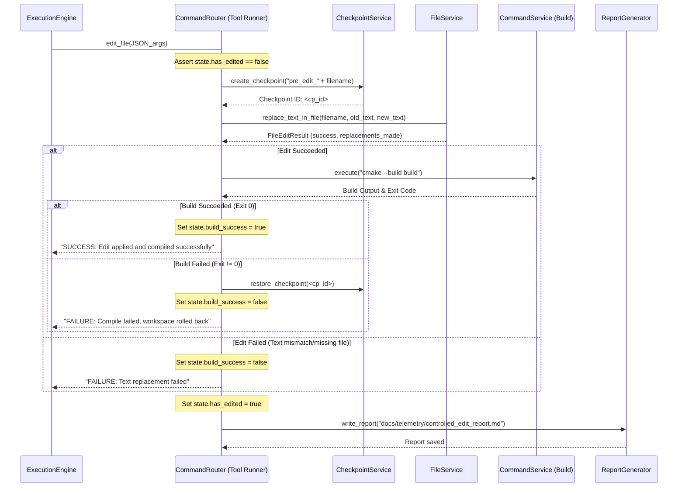

---
---

# [PROPOSAL: DESIGN ONLY - NOT YET IMPLEMENTED]

# Controlled Edit Mode v1: Design Document

**Phase:** Design Proposal  
**Status:** Approved for Implementation (Design Stage Only)  
**Objective:** Enable the C++ agent loop to execute a single code change safely, verify compilation, and immediately exit without introducing autonomous repair loops, planning iterations, or architectural complexity.


---

## 1. Safety Guardrails & Core Constraints

Controlled Edit Mode v1 is governed by seven strict architectural guardrails implemented at the native engine/routing level rather than relying on LLM self-discipline:

1. **Single-File Limit:** Only one target file may be modified. Any tool call specifying a second file is blocked.
2. **Mandatory Pre-Edit Checkpoint:** Before modifying any file on disk, the system automatically creates a workspace backup via `Services::CheckpointService`.
3. **Mandatory Post-Edit Build:** Immediately following text replacement, the system triggers a C++ compile run (`cmake --build build`).
4. **No Automatic Repair:** If compilation fails, the agent is **not** allowed to run another tool or attempt to fix the error. The loop halts immediately.
5. **No Second Edit:** A session-level boolean flag in `SessionState` prevents execution of more than one edit command.
6. **Automatic Rollback:** If compilation fails, the orchestrator automatically restores the workspace back to the pre-edit checkpoint before reporting the failure.
7. **Immediate Stop:** The agent loop terminates immediately after the edit and build sequence is executed, regardless of whether it succeeded or failed.

---

## 2. Integrated Tool Design: `edit_file`

Rather than exposing multiple low-level tools (`checkpoint`, `replace_text`, `build`, `restore`) to the agent, we consolidate this sequence into a single atomic tool call: `edit_file`. This encapsulates the safety workflow inside the C++ execution engine.

### Tool Signature
- **Tool Name:** `edit_file`
- **Arguments (JSON-Formatted):**
  ```json
  {
    "filename": "relative/path/to/file.cpp",
    "old_text": "text_to_be_replaced",
    "new_text": "replacement_text"
  }
  ```
  *Note: JSON arguments are parsed using `<nlohmann/json.hpp>` to prevent collision with special delimiters like colons (`:`) or newlines (`\n`) within the target code.*

### Execution sequence in C++ Tool Runner



---

## 3. Implementation Footprint (Total: ~100 lines of C++ code)

### 3.1 Session State Updates (`include/core/session_state.h`)
Add state trackers to the existing `SessionState` struct to track execution context:
```cpp
// Add to include/core/session_state.h within struct SessionState:
bool has_edited{false};              // Prevents execution of a second edit
bool build_success{false};           // Tracks compilation status of the edit
std::string edit_file_path{};        // Path of the edited file
std::string edit_checkpoint_id{};    // Pre-edit checkpoint ID
std::string edit_build_output{};     // Captured stdout/stderr of build command
```

### 3.2 Tool Registration & Routing (`src/app/command_router.cpp`)
Add the handler for `edit_file` in the tool execution lambda within `CommandRouter::process_user_input`:
```cpp
// Add to src/app/command_router.cpp within the lambda passed to engine.execute:
} else if (tc.tool == "edit_file") {
  if (agent_.state_.has_edited) {
    tr.out = "Error: An edit has already been performed in this session.";
    tr.exit_code = 1;
    return tr;
  }

  try {
    auto args = nlohmann::json::parse(tc.args);
    std::string filename = args.value("filename", "");
    std::string old_text = args.value("old_text", "");
    std::string new_text = args.value("new_text", "");

    if (filename.empty() || old_text.empty()) {
      tr.out = "Error: Missing required JSON fields ('filename', 'old_text')";
      tr.exit_code = 1;
      return tr;
    }

    agent_.state_.edit_file_path = filename;

    // 1. Mandatory Pre-Edit Checkpoint
    std::string cp_id = Services::CheckpointService::create_checkpoint(
        "pre_edit_" + Services::FileService::get_relative_path(filename, "."),
        "Controlled edit baseline"
    );
    agent_.state_.edit_checkpoint_id = cp_id;

    // 2. Perform Edit
    auto edit_res = Services::FileService::replace_text_in_file(filename, old_text, new_text);
    if (!edit_res.success) {
      tr.out = "Edit failed: " + edit_res.message;
      tr.exit_code = 1;
      agent_.state_.has_edited = true;
      agent_.state_.build_success = false;
      return tr;
    }

    // 3. Mandatory Post-Edit Build
    std::string build_out = Services::CommandService::execute("cmake --build build");
    agent_.state_.edit_build_output = build_out;
    bool compile_ok = (build_out.find("error:") == std::string::npos &&
                       build_out.find("Error 1") == std::string::npos);

    agent_.state_.has_edited = true;
    agent_.state_.build_success = compile_ok;

    if (compile_ok) {
      tr.out = "SUCCESS: Code modified and build passed.";
      tr.exit_code = 0;
    } else {
      // 4. Automatic Rollback on Compile Failure
      Services::CheckpointService::restore_checkpoint(cp_id);
      tr.out = "FAILURE: Compile failed. Workspace rolled back.";
      tr.exit_code = 2;
    }
  } catch (const std::exception &e) {
    tr.out = std::string("JSON parsing error: ") + e.what();
    tr.exit_code = 1;
  }
  
  // 5. Generate Report
  write_controlled_edit_report();
  return tr;
}
```

### 3.3 Engine Loop Termination (`src/services/execution_engine.cpp`)
We ensure that once `has_edited` is set to `true`, the loop terminates instantly without selecting subsequent tools.

- **In `select_next_tool` (deterministic / LLM branches):**
  If `has_edited` is set, return an empty `ToolCall` to immediately break the execution loop.
  ```cpp
  // Add at the beginning of select_next_tool and select_next_tool_llm:
  if (evidence.has_fact_containing("edit_file")) {
    return {}; // Halts the execution engine immediately
  }
  ```

- **In `check_completion`:**
  Once an edit is performed, the goal is checked as complete (so that the engine stops and records the outcome).
  ```cpp
  // Add to check_completion:
  if (type == CodeChange && evidence.has_fact_containing("edit_file")) {
    return true; 
  }
  ```

---

## 4. Telemetry Report Schema

Upon completion of the edit phase, the router writes a telemetry report to `docs/telemetry/controlled_edit_report.md`. This report logs the details of the modification and build outcome.

### Report Template
```markdown
# Controlled Edit Mode v1: Run Report

- **Timestamp:** [ISO-8601 Timestamp]
- **Target File:** `[filepath]`
- **Checkpoint ID:** `[cp_id]`
- **Edit Status:** [SUCCESS / FAILURE]
- **Compilation Status:** [PASSED / FAILED]
- **Automatic Rollback Triggered:** [YES / NO]

## Modification Diff Detail
```diff
-[old_text]
+[new_text]
```

## Compilation Diagnostic Output
```text
[Captured compile output]
```
```

---

## 5. Summary of Safety Benefits

- **Minimal Abstraction footprint:** The design requires no modifications to planners, goal-routing schemas, or search-ranking layers. It operates strictly as a sequential utility inside the `CommandRouter` tool runner.
- **Atomic Operations:** Workspace safety is guaranteed. Even if the agent fails to compile, the pre-edit checkpoint restores the files, preventing any broken code from being checked in or left on disk.
- **Runaway Prevention:** Zero repair-loop logic means the agent will never enter an infinite compile-edit-fail cycle.
